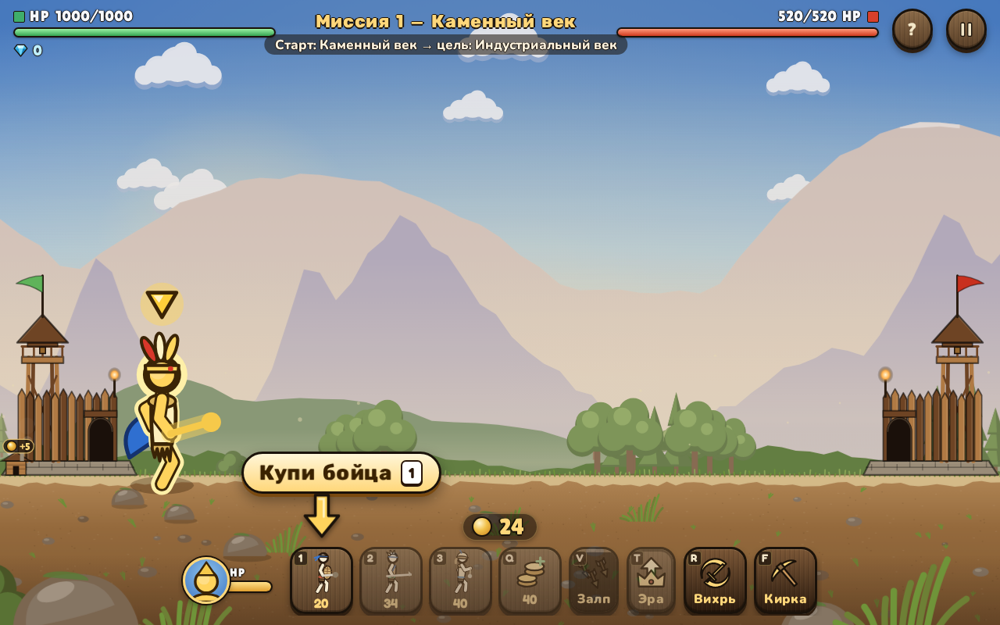

# Две крепости (Lane Battler)

Нанимайте отряд, улучшайте экономику и разрушьте вражескую крепость, защищая свою.

[Играть в тестовую сборку](https://fanatat.github.io/games-dev/lane-battle/)

Здесь размещена статическая версия для запуска в браузере.
Тестовая сборка может отличаться от файлов этого репозитория.

**Статус на 28 сентября 2026, подтверждён владельцем:** игра опубликована
в VK. В Яндекс Играх и CrazyGames пока не опубликована.



*Локальный запуск файлов этого репозитория, 28 сентября 2026.*

## Что это

Игрок нанимает юнитов четырёх ролей (пехота, копейщик, лучник, тяжёлый), прокачивает доход, ставит башни и лично управляет героем-капитаном, который наносит основной урон по вражеской крепости. Кампания — 5 глав по 3 миссии (15 миссий), три эпохи (камень, бронза, железо) меняют оружие и палитру, враг — адаптивный ИИ со своей экономикой.
Между миссиями — магазин постоянных улучшений (башни, ловушки, снаряжение героя, косметика). Управление с клавиатуры и сенсорное (виртуальный джойстик). Интерфейс на 11 языках: ru, en, tr, kk, pt, es, id, ar, de, fr, it. Музыка — mp3-треки в `assets/audio/`, записанные звуковые эффекты воспроизводятся через Web Audio и находятся в `assets/audio/`.

## Стек

- JavaScript без сборщика; интеграции с SDK площадок
- Canvas 2D — арена и процедурная анимация стикменов (`js/rig.js`); DOM — HUD, меню, магазин
- VK Bridge 3.0.2 (локальная копия в `js/vendor/`) и Yandex Games SDK — площадка определяется в `js/platform.js` по URL и окружению
- Сохранение прогресса: localStorage плюс облачное хранилище площадки (VK Storage / Yandex player data)

## Запуск локально

```bash
git clone https://github.com/Fanatat/lane-battle-vk.git
cd lane-battle-vk
python3 -m http.server 8000 --bind 127.0.0.1
```

Открыть `http://localhost:8000`. Без SDK площадки игра работает в dev-режиме (реклама и облачные сохранения отключены).

## Моя роль

Игра собрана командой ИИ-агентов (Claude Code) под руководством автора: постановка задачи, приёмка живым запуском и тестами, релиз — автор; код — агенты.

SDK площадок обеспечивают авторизацию, рекламу, покупки и облачные сохранения
в соответствующем окружении. Локальный HTTP-сервер не воспроизводит эти интеграции.

## Состав репозитория

`js/` — логика и адаптер площадки; `js/rig.js` — анимация;
`js/audio.js` — звук; `assets/audio/` — записи; `js/vendor/` — VK Bridge.

Ресурсы сборки: [CREDITS.md](CREDITS.md).
